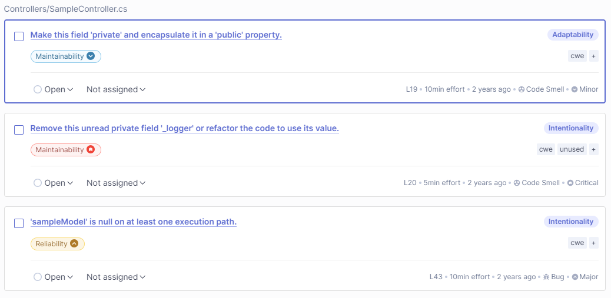

# Analise-de-codigo-estatico-com-sonarqube

## Passos para executar os testes no sonarqube:

1. Criar um container no docker para executar localmente o sonarqube por meio do comando

   `docker run -d --name sonarqube -p 9000:9000 -p 9092:9092 sonarqube`


2. Após a execução do container entrei na porta 9000 e criei um projeto local.


1. Ao criar o projeto foi gerado um token. Para executar os testes copiei os comandos da na imagem abaixo e colei no caminho onde a solução “SampleApp” se encontra.

Caminho: \Analise-de-codigo-estatico-com-sonarqube\dotnet-sonarqube-example


Resultado obtido no terminal:


## Resultados dos teste no sonarqube:


Conclusões:

- Segurança: Não há problemas de segurança encontrados.
- Confiabilidade: Existem 2 problemas que podem afetar a confiabilidade do código.
- Manutenibilidade: Existem 4 problemas com o código em questão de manutenção do código.
- Duplicações: 0.0% indica que não há código duplicado.
- Cobertura de Testes: 0.0% sugere que não há testes escritos.
- Hotspots Revisados: 0.0% indica que nenhum hotspot de código foi revisado.

### Issues sugeridas pelo sonarqube:




#### Alterações no controller:

```
        private int _publicVariable;
        public int PublicVariable
        {
            get { return _publicVariable; }
            set { _publicVariable = value; }
        }
```

```
        [HttpGet("/BugOnNullPath")]
        public SampleModel GetBugOnNullPath()
        {
            SampleModel sampleModel = new SampleModel();
            sampleModel.Date = DateTime.Now;
            return sampleModel;
        }
```

#### Resultados após refatoração:


## Sobre o Sonarqube:

- O Sonarqube é um ferramenta utilizada para testar a qualidade do código por meio de baterias de testes feitas no repositório. Ele detecta problemas como bugs, vulnerabilidades, "code smells" e duplicidade de código. Por meio desses insights é possível realizar a refatoração do código afim de melhorar seu funcionamente e sua qualidade. A plataforma oferece um dashboard intuitivo que apresenta métricas e insights, facilitando a identificação e correção de problemas no código de forma eficiente.

## Aprendizados Pessoais:

- Compreendi como o SonarQube apresenta métricas de qualidade de código e o que cada uma representa, como segurança, confiabilidade, manutenibilidade, cobertura de testes e duplicações. Além disso, entendi ainda mais a importância de manter boas práticas ao implementar o código, pois caso ele não esteja conforme o padrão o SonarQube informa o erro e é necessário refatorar o código.
- Outro ponto que aprendi é a importância da revisão de segurança no código, especialmente em contextos onde os dados precisam ser protegidos ou as operações não devem ser previsíveis. A análise estática pode destacar potenciais vulnerabilidades, como o uso de geradores de números pseudoaleatórios em contextos que exigem segurança mais robusta, e o SonarQube é uma ferramenta valiosa para identificar essas questões.
- Também reconheci que a cobertura de testes é um indicador crítico da saúde do código. Uma baixa cobertura de testes, como mostrado nos relatórios do SonarQube, é um sinal de alerta que necessita de ação imediata, seja escrevendo testes unitários, testes de integração ou outros tipos de testes automatizados para garantir que o código se comporta conforme esperado e que as mudanças futuras não introduzam novos defeitos.
- Por fim, entendi que o SonarQube fornece orientações não apenas para a correção de problemas imediatos, mas também oferece insights para a melhoria contínua do código. Ao incorporar as recomendações e métricas fornecidas pelo SonarQube no ciclo de vida do desenvolvimento de software, as equipes podem melhorar proativamente a qualidade do código, tornando-o mais limpo, seguro e fácil de manter ao longo do tempo.
